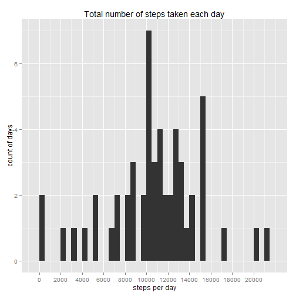
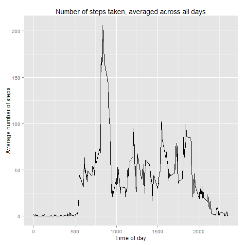
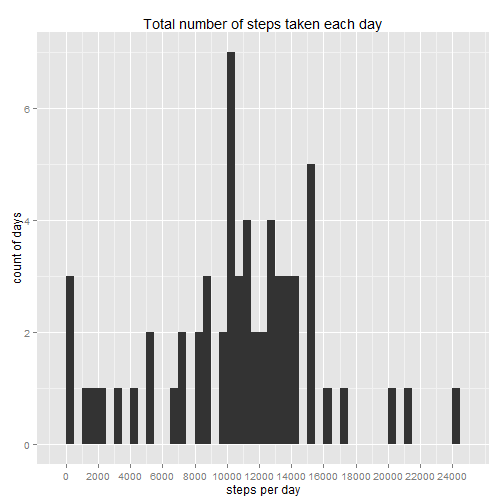
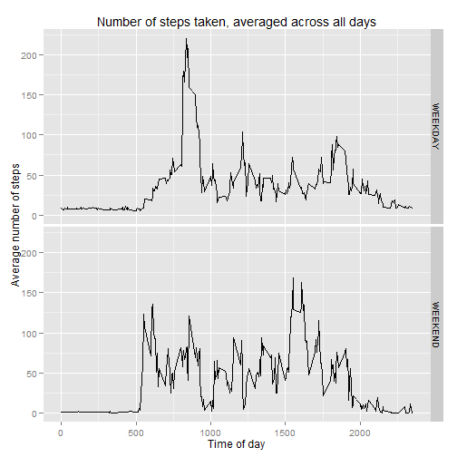

# Reproducible Research: Peer Assessment 1


## 1. Loading and preprocessing the data

### 1.1. Loading the data

```r
require(data.table)
```

```
## Loading required package: data.table
```

```r
require(ggplot2)
```

```
## Loading required package: ggplot2
```

```r
require(scales)
```

```
## Loading required package: scales
```

```r
setwd("~/Git/RepData_PeerAssessment1/")
unzip("./activity.zip", "activity.csv")
dtData <- fread("activity.csv")
```


### 1.2. Process/transform the data

```r
dtData$date <- as.POSIXct(strptime(dtData$date, format = "%Y-%m-%d"))
dtData$weekend <- as.factor(weekdays(dtData$date) %in% c("Sunday", "Saturday"))

dtPerDay <- dtData[, list(sum = sum(steps), mean = mean(steps)), by = date]
dtPerDay <- cbind(dtPerDay, tapply(dtData$steps, dtData$date, median))
setnames(dtPerDay, c("V2"), c("median"))
```


## 2. What is mean total number of steps taken per day?

### 2.1. Figure: Total number of steps taken each day

```r
ggplot(dtPerDay, aes(x = dtPerDay$sum)) + geom_histogram(binwidth = 500) + xlab("steps per day") + 
    ylab("count of days") + ggtitle("Total number of steps taken each day") + 
    scale_x_continuous(breaks = seq(0, max(dtPerDay$sum, na.rm = TRUE), by = 2000))
```

 


### 2.2. Table: Mean and median for total number or steps taken per day 

```r
dtPerDay[, list(date = date, mean = mean, meadian = median)]
```

```
##           date    mean meadian
##  1: 2012-10-01      NA      NA
##  2: 2012-10-02  0.4375       0
##  3: 2012-10-03 39.4167       0
##  4: 2012-10-04 42.0694       0
##  5: 2012-10-05 46.1597       0
##  6: 2012-10-06 53.5417       0
##  7: 2012-10-07 38.2465       0
##  8: 2012-10-08      NA      NA
##  9: 2012-10-09 44.4826       0
## 10: 2012-10-10 34.3750       0
## 11: 2012-10-11 35.7778       0
## 12: 2012-10-12 60.3542       0
## 13: 2012-10-13 43.1458       0
## 14: 2012-10-14 52.4236       0
## 15: 2012-10-15 35.2049       0
## 16: 2012-10-16 52.3750       0
## 17: 2012-10-17 46.7083       0
## 18: 2012-10-18 34.9167       0
## 19: 2012-10-19 41.0729       0
## 20: 2012-10-20 36.0938       0
## 21: 2012-10-21 30.6285       0
## 22: 2012-10-22 46.7361       0
## 23: 2012-10-23 30.9653       0
## 24: 2012-10-24 29.0104       0
## 25: 2012-10-25  8.6528       0
## 26: 2012-10-26 23.5347       0
## 27: 2012-10-27 35.1354       0
## 28: 2012-10-28 39.7847       0
## 29: 2012-10-29 17.4236       0
## 30: 2012-10-30 34.0938       0
## 31: 2012-10-31 53.5208       0
## 32: 2012-11-01      NA      NA
## 33: 2012-11-02 36.8056       0
## 34: 2012-11-03 36.7049       0
## 35: 2012-11-04      NA      NA
## 36: 2012-11-05 36.2465       0
## 37: 2012-11-06 28.9375       0
## 38: 2012-11-07 44.7326       0
## 39: 2012-11-08 11.1771       0
## 40: 2012-11-09      NA      NA
## 41: 2012-11-10      NA      NA
## 42: 2012-11-11 43.7778       0
## 43: 2012-11-12 37.3785       0
## 44: 2012-11-13 25.4722       0
## 45: 2012-11-14      NA      NA
## 46: 2012-11-15  0.1424       0
## 47: 2012-11-16 18.8924       0
## 48: 2012-11-17 49.7882       0
## 49: 2012-11-18 52.4653       0
## 50: 2012-11-19 30.6979       0
## 51: 2012-11-20 15.5278       0
## 52: 2012-11-21 44.3993       0
## 53: 2012-11-22 70.9271       0
## 54: 2012-11-23 73.5903       0
## 55: 2012-11-24 50.2708       0
## 56: 2012-11-25 41.0903       0
## 57: 2012-11-26 38.7569       0
## 58: 2012-11-27 47.3819       0
## 59: 2012-11-28 35.3576       0
## 60: 2012-11-29 24.4688       0
## 61: 2012-11-30      NA      NA
##           date    mean meadian
```


## 3. What is the average daily activity pattern?

### 3.1. Daily pattern

```r
dtPerInterval <- dtData[, list(sum = sum(steps, na.rm = TRUE), mean = mean(steps, 
    na.rm = TRUE)), by = interval]
ggplot(dtPerInterval, aes(x = dtPerInterval$interval, y = dtPerInterval$mean)) + 
    geom_line() + xlab("Time of day") + ylab("Average number of steps") + ggtitle("Number of steps taken, averaged across all days")
```

 


### 3.2. Maximum activity

```r
maxInterval <- dtPerInterval[max(dtPerInterval$mean) == dtPerInterval$mean, 
    interval]
```

Interval: 835 contains maximum number of steps on average across all measured days. 

## 4. Imputing missing values

### 4.1. Report missing values

```r
misValCount <- sum(!complete.cases(dtData))
```

There are 2304 records with missing values in the dataset.

### 4.2. Strategy for filling the missing values
We will use mean of the mean across all days for missing values.

```r
dtMerged <- merge(dtData[is.na(dtData$steps), ], dtPerInterval, by = "interval")
```


### 4.3. Filling the missing values in new data.frame

```r
dtFilled <- dtData
dtFilled[is.na(dtFilled$steps)]$steps <- as.integer(dtMerged$mean)
dtFilledPerDay <- dtFilled[, list(sum = sum(steps), mean = mean(steps)), by = date]
dtFilledPerDay <- cbind(dtFilledPerDay, tapply(dtFilled$steps, dtFilled$date, 
    median))
setnames(dtFilledPerDay, c("date", "sum", "mean", "V2"), c("date", "sum", "mean", 
    "median"))
```


### 4.4. Visualize with filled values

```r
ggplot(dtFilledPerDay, aes(x = dtFilledPerDay$sum)) + geom_histogram(binwidth = 500) + 
    xlab("steps per day") + ylab("count of days") + ggtitle("Total number of steps taken each day") + 
    scale_x_continuous(breaks = seq(0, max(dtFilledPerDay$sum, na.rm = TRUE), 
        by = 2000))
```

 


```r
dtFilledPerDay[, list(date = date, mean = mean, meadian = median)]
```

```
##           date    mean meadian
##  1: 2012-10-01  0.2222     0.0
##  2: 2012-10-02  0.4375     0.0
##  3: 2012-10-03 39.4167     0.0
##  4: 2012-10-04 42.0694     0.0
##  5: 2012-10-05 46.1597     0.0
##  6: 2012-10-06 53.5417     0.0
##  7: 2012-10-07 38.2465     0.0
##  8: 2012-10-08  4.1944     0.5
##  9: 2012-10-09 44.4826     0.0
## 10: 2012-10-10 34.3750     0.0
## 11: 2012-10-11 35.7778     0.0
## 12: 2012-10-12 60.3542     0.0
## 13: 2012-10-13 43.1458     0.0
## 14: 2012-10-14 52.4236     0.0
## 15: 2012-10-15 35.2049     0.0
## 16: 2012-10-16 52.3750     0.0
## 17: 2012-10-17 46.7083     0.0
## 18: 2012-10-18 34.9167     0.0
## 19: 2012-10-19 41.0729     0.0
## 20: 2012-10-20 36.0938     0.0
## 21: 2012-10-21 30.6285     0.0
## 22: 2012-10-22 46.7361     0.0
## 23: 2012-10-23 30.9653     0.0
## 24: 2012-10-24 29.0104     0.0
## 25: 2012-10-25  8.6528     0.0
## 26: 2012-10-26 23.5347     0.0
## 27: 2012-10-27 35.1354     0.0
## 28: 2012-10-28 39.7847     0.0
## 29: 2012-10-29 17.4236     0.0
## 30: 2012-10-30 34.0938     0.0
## 31: 2012-10-31 53.5208     0.0
## 32: 2012-11-01 84.4444    53.5
## 33: 2012-11-02 36.8056     0.0
## 34: 2012-11-03 36.7049     0.0
## 35: 2012-11-04 49.7222    39.0
## 36: 2012-11-05 36.2465     0.0
## 37: 2012-11-06 28.9375     0.0
## 38: 2012-11-07 44.7326     0.0
## 39: 2012-11-08 11.1771     0.0
## 40: 2012-11-09 47.4444    43.0
## 41: 2012-11-10 56.6111    56.0
## 42: 2012-11-11 43.7778     0.0
## 43: 2012-11-12 37.3785     0.0
## 44: 2012-11-13 25.4722     0.0
## 45: 2012-11-14 47.0556    38.0
## 46: 2012-11-15  0.1424     0.0
## 47: 2012-11-16 18.8924     0.0
## 48: 2012-11-17 49.7882     0.0
## 49: 2012-11-18 52.4653     0.0
## 50: 2012-11-19 30.6979     0.0
## 51: 2012-11-20 15.5278     0.0
## 52: 2012-11-21 44.3993     0.0
## 53: 2012-11-22 70.9271     0.0
## 54: 2012-11-23 73.5903     0.0
## 55: 2012-11-24 50.2708     0.0
## 56: 2012-11-25 41.0903     0.0
## 57: 2012-11-26 38.7569     0.0
## 58: 2012-11-27 47.3819     0.0
## 59: 2012-11-28 35.3576     0.0
## 60: 2012-11-29 24.4688     0.0
## 61: 2012-11-30  5.8889     3.5
##           date    mean meadian
```

**Observation:**  
- Filling means across all days for the missing values slightly changes the histogram, we see there are overall more days shown in the plot.
- The difference is also visible in the table of *MEANS* and *MEDIANS*, while there were missing values in the secion No. 2, we can see values with artificialy inserted data. Especially notable is diffrence in *MEDIANS*.

## 5.Are there differences in activity patterns between weekdays and weekends? 

### 5.1 Set weekend factor levels

```r
levels(dtFilled$weekend) <- c("WEEKDAY", "WEEKEND")
```


### 5.2 Visualize weekends vs weekdays

```r
ggplot(dtFilled, aes(x = dtFilled$interval, y = dtFilled$steps)) + stat_summary(fun.y = mean, 
    geom = "line") + xlab("Time of day") + ylab("Average number of steps") + 
    ggtitle("Number of steps taken, averaged across all days") + facet_grid(weekend ~ 
    .)
```

 

